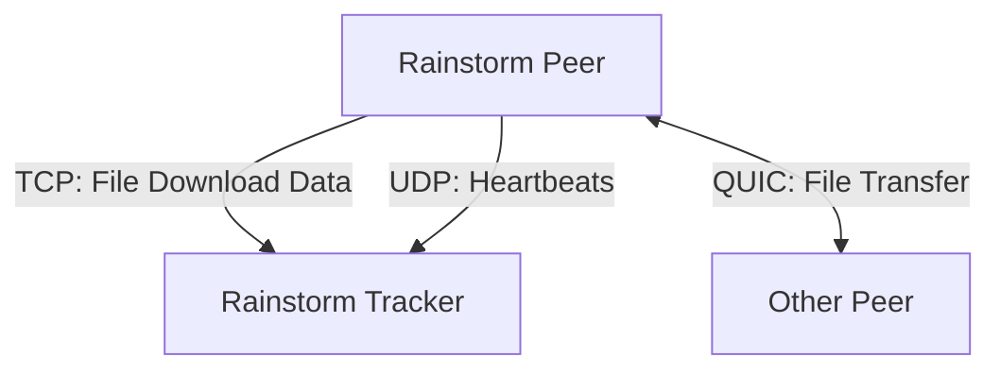
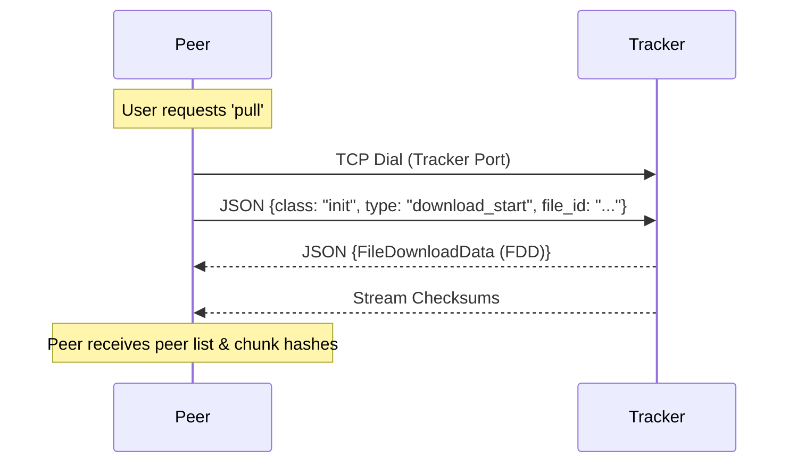
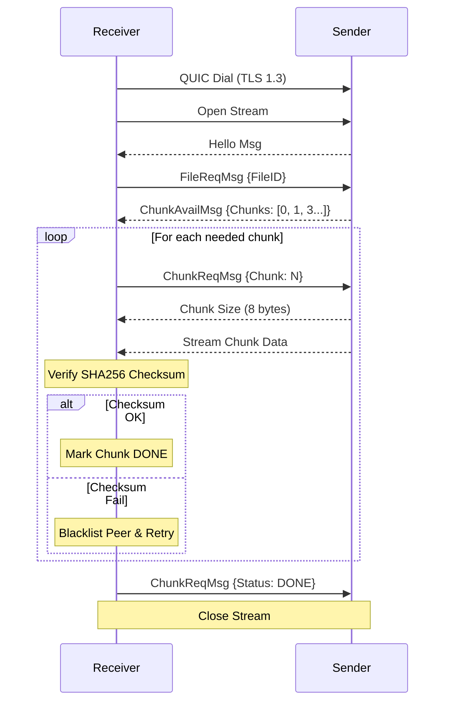

# Rainstorm Peer Architecture

The Rainstorm Peer is a component of a file sharing system designed for resilience and performance. It operates by interacting with a central tracker for metadata and other peers for data transfer.

## Connectivity Overview

## Core Components

### 1. Main Entry (`peer.go`)
- **Responsibility**: Orchestrates the application lifecycle.
- **Functionality**:
    -   Initializes the `Chunker`, `TrackerManager`, and `Receiver`.
    -   Starts the background `aliveHandler` to send heartbeats to trackers.
    -   Starts the QUIC listener for incoming peer connections.
    -   Provides a CLI loop for user commands (`push`, `pull`, etc.).

### 2. Chunker (`fileChunk.go`)
- **Responsibility**: Manages file segmentation and storage.
- **Functionality**:
    -   Splits input files into fixed-size chunks (default 10KB).
    -   Calculates SHA256 hashes for each chunk for integrity verification.
    -   Stores chunks on disk in a specified directory (`RSTM_SAVE_PATH`).
    -   Manages the state of chunks (EMPTY, BUSY, DONE).
    -   Reassembles chunks back into the original file upon download completion.

### 3. Receiver (`receiver.go`)
- **Responsibility**: Handles file downloading from other peers.
- **Functionality**:
    -   Fetches File Download Data (FDD) from the tracker via TCP.
    -   Manages parallel downloads using multiple threads (up to `MAX_RECV_THREADS`).
    -   Connects to peers via QUIC to request specific chunks.
    -   Verifies chunk integrity using checksums from the FDD.
    -   Handles peer blacklisting for failed or malicious peers.

### 4. Sender (`sender.go`)
- **Responsibility**: Handles serving files to other peers.
- **Functionality**:
    -   Listens for incoming QUIC streams.
    -   Responds to `FileReqMsg` and `ChunkReqMsg`.
    -   Streams chunk data to requesting peers.
    -   Also handles pushing local file metadata (FDD) to the tracker during a `push` operation.

### 5. Tracker Manager (`trackerManager.go`)
- **Responsibility**: Tracks which files are associated with which trackers.
- **Functionality**:
    -   Maintains a mapping of Tracker IPs to File IDs.
    -   Used by `aliveHandler` to send periodic heartbeat updates to relevant trackers, keeping the peer "alive" in the tracker's records.

### 6. File Manager (`fileManager.go`)
- **Responsibility**: Manages higher-level file metadata.
- **Functionality**:
    -   Maps File IDs to local file names, tracker IPs, and internal Chunker IDs.
    -   Supports saving and loading the file index to disk (CSV format).

## Communication Protocols

### Peer-to-Tracker (TCP & UDP)
-   **TCP**: Used for reliable operations like registering a file (`push`) or starting a download (`pull`).
    -   **Push**: Peer sends `file_register` message with FDD.
    -   **Pull**: Peer sends `download_start` message to get FDD.
-   **UDP**: Used for lightweight heartbeats (`aliveHandler`).
    -   Peer sends a list of file IDs it hosts to the tracker every 10 seconds.

#### Sequence: Peer-to-Tracker Interaction (Pull)

### Peer-to-Peer (QUIC)
-   **Protocol**: QUIC (Quick UDP Internet Connections) over UDP.
-   **Security**: TLS 1.3 is forced (currently using self-signed certs).
-   **Flow**:
    1.  **Handshake**: Receiver connects to Sender.
    2.  **File Request**: Receiver asks for a specific File ID.
    3.  **Chunk Availability**: Sender replies with a list of chunks it has (`ChunkAvailMsg`).
    4.  **Chunk Request**: Receiver requests a specific chunk.
    5.  **Data Transfer**: Sender streams the chunk data.

#### Sequence: Peer-to-Peer Transfer (QUIC)

## Data Structures

### File Download Data (FDD)
Contains all info needed to download a file:
-   `FileID`: Unique UUID.
-   `FileName`: Human-readable name.
-   `Peers`: List of peers (IP:Port) that have the file.
-   `Checksums`: List of SHA256 hashes for each chunk.
-   `ChunkCount`: Total number of chunks.

### Messages (`messages.go`)
JSON-based messages exchanged between peers:
-   `FileReqMsg`: Request for a file.
-   `ChunkAvailMsg`: List of available chunks.
-   `ChunkReqMsg`: Request for a specific chunk.
